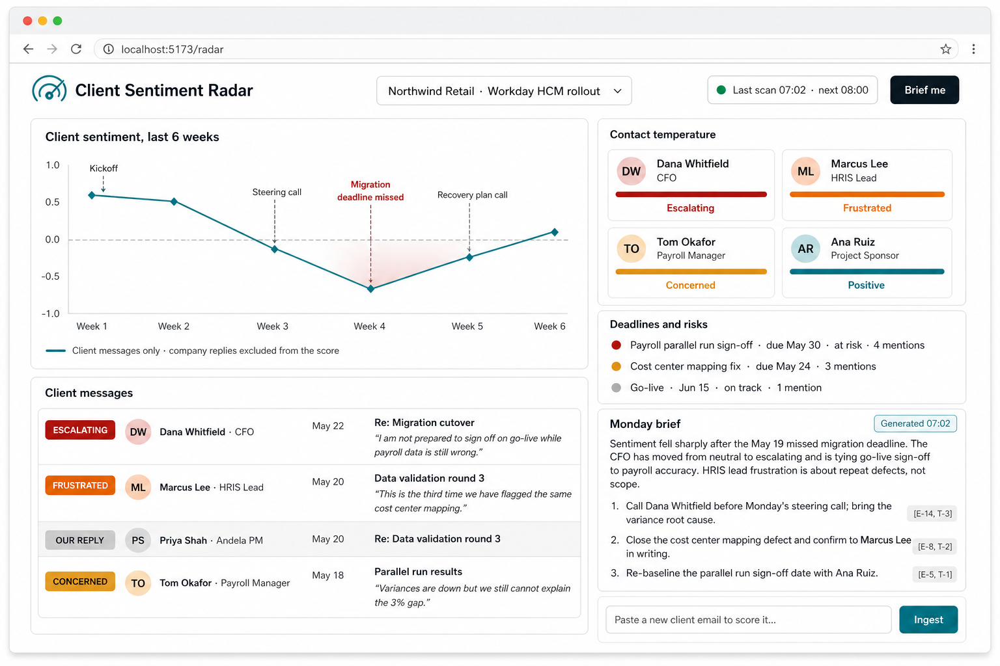
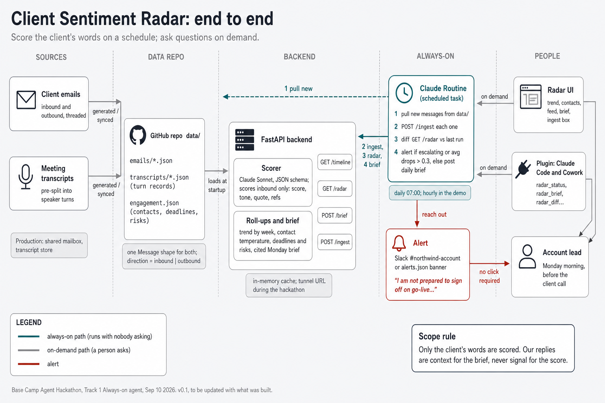

# Client Sentiment Radar

An always-on agent that reads a client's own words across an engagement (emails, meeting transcripts) and shows the account lead where the temperature is, where it is heading, and which deadlines and risks it is tied to. Built in 60 minutes at the Anthropic Partner Base Camp Agent Hackathon, San Francisco, September 10, 2026.

Track: Always-on agent. Team: Eric Blue (Andela, backend) with three Deloitte developers (data, UI, routine and demo).



## The idea in one paragraph

Account leads find out a client is unhappy late, when it reaches an escalation email or a steering committee. The signal was there earlier, spread across threads and transcripts nobody reads end to end. The radar scores every client message on a schedule, rolls it up into a trend, a per-contact temperature and a list of at-risk deadlines, and writes a cited Monday brief. A plugin lets anyone ask it questions from Claude Code or Cowork. One rule throughout: sentiment is measured on what the client says; our own replies are context for the brief, never signal for the score.

## Docs

| Doc | What it is |
|---|---|
| [PRD and tech spec](docs/PRD-and-Tech-Spec.md) | Problem, scope rule, MVP capabilities, demo, architecture, the data contract everyone builds against, model use, risks |
| [Workstreams](docs/Workstreams.md) | The hour split into four lanes (data, backend, UI, routine and demo) with a shared clock and handoff minutes |
| [Plugin use cases](docs/Plugin-Use-Cases.md) | The six plugin tools and ten question-and-answer examples, plus what the plugin refuses to do |
| [Architecture](docs/architecture.png) | End to end: sources, data repo, backend, the always-on routine and alert, the UI and plugin. v0.1, to be updated with what was built |
| [Mockup: dashboard](docs/mockup-1-dashboard.png) | The single-page radar UI |
| [Mockup: plugin](docs/mockup-2-plugin.png) | The same intelligence asked from Claude Code and Cowork |

## Architecture



```
data/                      synthetic engagement: emails/*.json, transcripts/*.json (turn records), engagement.json
backend/  (FastAPI)        scores client messages with Claude (structured output), caches, serves:
                           GET /timeline  GET /radar  POST /brief  POST /ingest  GET /stub/*
ui/       (Vite+React+TS)  trend line, contact grid, message feed, brief panel; one base URL
plugin/   (MCP, stretch)   radar_status, radar_contact, radar_search, radar_brief, radar_ingest, radar_diff
routine/                   the always-on half: a Claude Routine that on a schedule pulls new messages from data/,
                           calls POST /ingest, diffs GET /radar, and posts an alert (Slack or alerts.json)
                           when a contact turns escalating or the weekly average drops. Essential, not stretch.
```

The routine is the unattended half; the UI and plugin are the on-demand half. The backend is reached from the routine through a tunnel (`cloudflared tunnel --url http://localhost:8000`) during the hackathon. See the PRD, section 5a.

## Data contract

Frozen at minute 10. Everything builds against these shapes; see the PRD for the full version.

```
Message   { id, thread_id, kind, direction: inbound|outbound, contact{name,role,org}, date, subject?, text,
            score?, tone?: positive|neutral|concerned|frustrated|escalating, quote?, refs?[] }
Engagement{ client, project, contacts[], deadlines[{id,title,due,status}], risks[{id,title,severity}] }
Radar     { trend[{week,avg_score,n}], contacts[{name,role,temperature,last_quote}],
            deadlines[{...,at_risk,mentions[]}], risks[{...,mentions[]}] }
Brief     { summary, actions[{text, cites[]}] }
```

Only `direction: inbound` messages get `score`, `tone` and `quote`.

Transcripts are stored pre-split as turn records in the same `Message` shape, not as whole files: `kind: "transcript_turn"`, `thread_id` = the meeting id, plus `meeting: {title, date}` denormalised on each turn and `seq` for order. A client's turn is `direction: inbound`, ours is `outbound`, so the scorer filters transcripts exactly the way it filters email. The data lane generates each meeting as an array of turns in one Claude call; a readable transcript, if wanted for the demo, is rendered from the turns rather than stored twice.

## Running it

Backend (from the Basecamp venv, key in `.env`):

```bash
cd backend
pip install -r requirements.txt
uvicorn app:app --reload --port 8000
# stub data:  http://localhost:8000/stub/radar
# live:       http://localhost:8000/radar
```

UI:

```bash
cd ui
npm install
npm run dev          # http://localhost:5173, reads VITE_API_BASE (default /stub)
```

Plugin (stretch): scaffolded with `mcp-plugin-pattern` so the same MCP server loads in Claude Code and Cowork; points at the backend base URL.

## Demo (two minutes)

1. Open the radar on the Northwind Retail engagement: warm in weeks one and two, a dip after the missed May 19 migration deadline, the CFO in red.
2. Click the dip, read the driving quote.
3. Press Brief me, read the three cited actions.
4. Paste in a new escalating email, watch the line drop and the brief change.
5. Switch to Claude Code: "How is the Northwind account feeling this week?"
6. From a second laptop, commit one new escalating email to `data/emails/` and fire the routine. The alert lands in Slack (or the banner appears) with nobody touching the dashboard; open the dashboard and the line has already moved.
7. Close: in production this runs every morning against the shared mailbox.

## Status

Hackathon scaffold. Synthetic data only; no mailbox or calendar integration, no auth, in-memory state. See the PRD's out-of-scope list.
